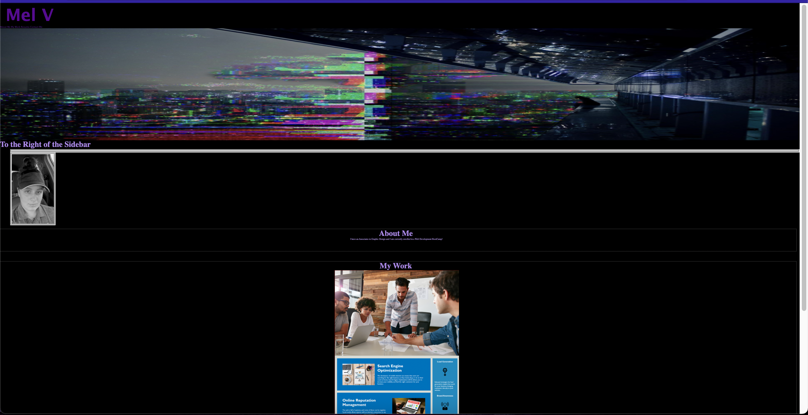

# Mels-Portfolio
my portfolio I will be making
# Mels-Portfolio

[link to LIVE site] ()

## Table of Contents

1.[Description](#Description)

2.[Screen Shots](#Screenshots)

3.[License](#License)

4.[Usage](#Usage)

5.[Badges](#Badges)

## Description
A trial and error of my first Portfolio Webpage 

## Screenshots

## License
MIT

## Usage

## Badges
HTML & Style.CSS
